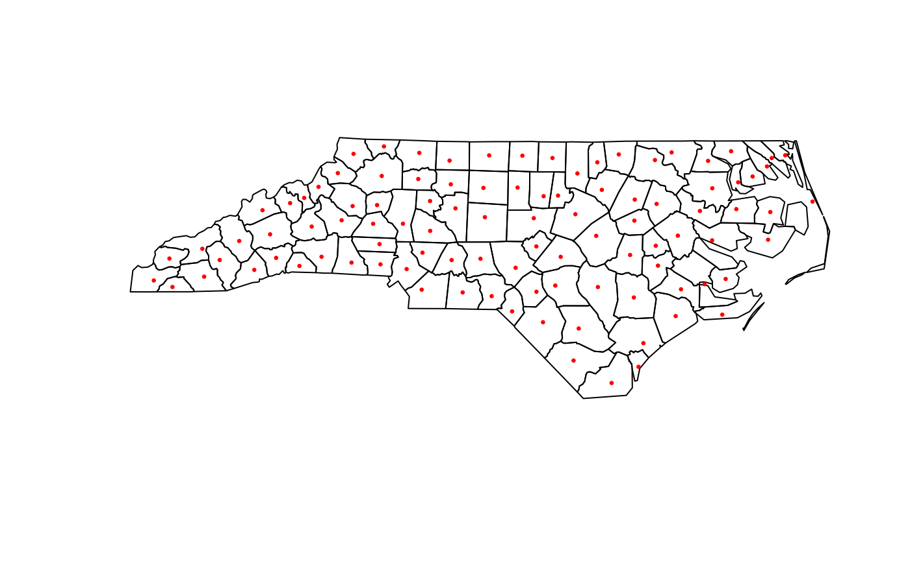
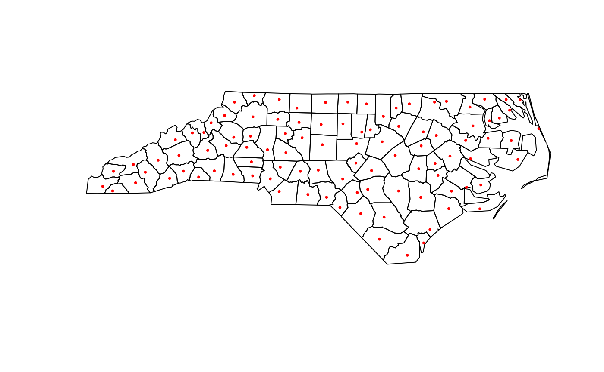

# Typical Usage

This package was designed to be used to easily calculate population
weighted centroids within R. While there are many scenarios in which you
may require a weighted centroid, I present the following as an typical
workflow for my usage.

For this example we are going to be calculating the population weighted
centroids for North Carolina counties. As such, we require population
and geographic data at a more granular geographic classification. We
will use tracts.

## Downloading Data

We can download census population estimates and geographic layer files
using the ever convenient `tidycensus` package. `sf` also has a North
Carolina counties file, which we will use later, but you can always
download census geometries directly from the census using `tigris`.

``` r
library(centr)
library(sf)
library(tidycensus)

NC_tracts <- get_decennial(
  "tract",
  state = "NC",
  "P1_001N",
  year = 2020,
  geometry = TRUE
)
NC_counties <- st_read(system.file("shape/nc.shp", package = "sf"))
```

## Setting Up

We will need fields that tells us what county each tract is in and how
many people live within each tract. Thankfully, the first 5 digits of
the GEOID, uniquely identify the county a tract is in, which means that
we can easily create a new field with this ID. The value field also
gives us our weights.

``` r
NC_tracts <- NC_tracts |>
  transform(GEOID_county = substring(GEOID, 1, 5)) |>
  subset(select = c(GEOID_county, value))
```

Let’s use
[`mean_center()`](https://ryanzomorrodi.github.io/centr/reference/mean_center.md)
to get our county geometries!

``` r
mean_center(NC_tracts, group = "GEOID_county", weight = "value")
#> Error in `mean_center()`:
#> ! `x` can't contain empty geometries.
```

Oh, it looks like we forgot one thing. At least one of our tracts has an
empty geometry. Before running
[`mean_center()`](https://ryanzomorrodi.github.io/centr/reference/mean_center.md),
we must filter out empty geometries.

``` r
NC_tracts <- subset(NC_tracts, !st_is_empty(NC_tracts))
```

## Calculation Mean Centers

Now, we can calculate our mean centers!

``` r
NC_county_means <- mean_center(
  NC_tracts,
  group = "GEOID_county",
  weight = "value"
)
NC_county_means
#> Simple feature collection with 100 features and 1 field
#> Geometry type: POINT
#> Dimension:     XY
#> Bounding box:  xmin: -84.02568 ymin: 34.0428 xmax: -75.67387 ymax: 36.49819
#> Geodetic CRS:  NAD83
#> # A tibble: 100 × 2
#>    GEOID_county             geometry
#>  * <chr>                 <POINT [°]>
#>  1 37001        (-79.41359 36.07104)
#>  2 37003        (-81.19492 35.88941)
#>  3 37005        (-81.10783 36.49819)
#>  4 37007        (-80.10947 34.98287)
#>  5 37009        (-81.49321 36.42097)
#>  6 37011        (-81.93716 36.07862)
#>  7 37013        (-76.94663 35.52365)
#>  8 37015        (-76.94512 36.06374)
#>  9 37017        (-78.63796 34.60854)
#> 10 37019          (-78.2212 34.0428)
#> # ℹ 90 more rows
```

Let’s see how it looks.

``` r
plot(st_geometry(NC_counties))
plot(st_geometry(NC_county_means), pch = 20, cex = 0.5, col = "red", add = TRUE)
```



## Calculating Median Centers

We can also calculate median centers, which is the point that minimizes
distance to all geometries.

``` r
NC_county_medians <- median_center(
  NC_tracts,
  group = "GEOID_county",
  weight = "value"
)
NC_county_medians
#> Simple feature collection with 100 features and 1 field
#> Geometry type: POINT
#> Dimension:     XY
#> Bounding box:  xmin: -84.01418 ymin: 34.02256 xmax: -75.6836 ymax: 36.52039
#> Geodetic CRS:  NAD83
#> # A tibble: 100 × 2
#>    GEOID_county             geometry
#>  * <chr>                 <POINT [°]>
#>  1 37001        (-79.42453 36.07912)
#>  2 37003        (-81.19136 35.88628)
#>  3 37005        (-81.11889 36.52039)
#>  4 37007         (-80.09359 34.9732)
#>  5 37009         (-81.49626 36.4186)
#>  6 37011         (-81.94286 36.0956)
#>  7 37013        (-76.98811 35.53398)
#>  8 37015        (-76.94037 36.04655)
#>  9 37017        (-78.63911 34.61783)
#> 10 37019        (-78.19474 34.02256)
#> # ℹ 90 more rows
```

Let’s see how it looks.

``` r
plot(st_geometry(NC_counties))
plot(
  st_geometry(NC_county_medians),
  pch = 20,
  cex = 0.5,
  col = "red",
  add = TRUE
)
```



And that’s the whole game, so go out and try it for yourself!
